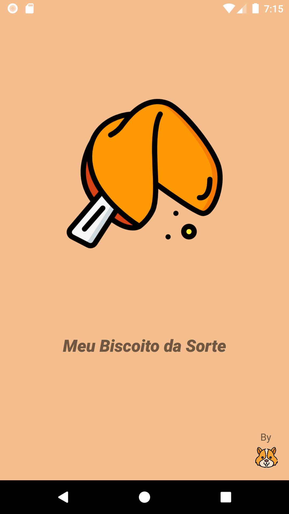
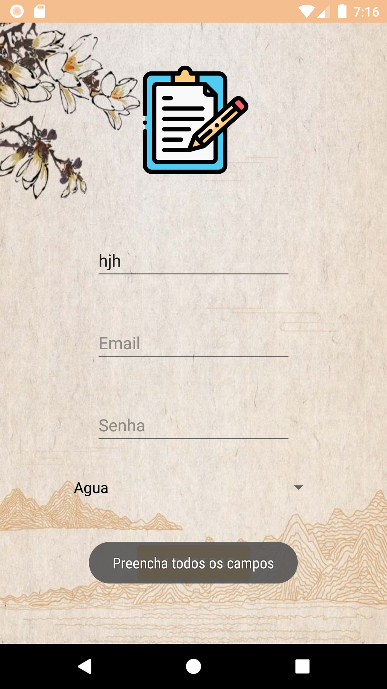

# Meu Biscoito da Sorte

Esse APP foi o meu projeto Final do curso Desenvolvimento de Aplicativos Android Studio (Kotlin)  da Cellep e Estação Hack;

## Sobre o Projeto

Foi feito uma maratona de desenvolvimento, onde houve varias propostas de aplicativos e escolhi  o  "Biscoito da Sorte". 

O desafio foi:

 *Crie um aplicativo que exiba frases aleatórias, podem ser frases de sorte, motivacionais, de auto estima, para foco nos estudos, memes engraçados, piadas etc...

\# Requisitos mínimos:
\* Exiba uma frase aleatória após a abertura do app;
\* Exiba frases aleatórias quando o usuário clicar em um botão.

### Desenvolvimento

No desenvolvimento  incrementei um buscador de preferências junto com a parte da "Sorte" aonde deveria ter em uma das tela um botão que quando pressionado mostra de forma randômica uma Frase em um Alerta/Toast.

### Resultado

 #### Tela de Splash, com duração de 4 segundos;

#### Tela de Login com um Pop- Up de bem vindo assim que saiu a tela de splash. Tela contém área para o usuário inserir seu email e senha;

#### Na tela Main  caso o usuário coloque dados diferentes do que está cadastro no banco de dados ou não tenha uma conta  no aplicativo irá aparecer um pop com a informação "usuário ou senha inválidos";

#### Tela Main com 2 bottons, o principal para o usuário gerar a sua frase, o inferior para  sair de sua conta e voltar para a tela de Login. Na parte de cima ainda contém o nome do usuário e o seu elemento escolhido(Informações que vieram do cadastro feito no próprio aplicativo);

####  Alerta/Toast com a frase gerada randomicamente  que aparece assim que o usuário pressiona o botão principal.

#### Alerta/Toast  com a função de saída após o usuário pressionar o botão sair na tela Main;

#### Tela de Cadastro contém áreas para o usuário inserir seus dados: nome, email, senha com um spinner para escolher um elemento. Essas informações são usadas para o usuário  se cadastrar no aplicativo;

#### Caso o usuário não insira todas os dados, um pop-up surge  informando que ele deve preencher todos os campos; 

#### Logo após criar o cadastro o usuário vai para a tela Main e surge um pop-up "Usuário Cadastrado"

### Agradecimentos:

Gostaria de  agradecer a Estação Hack e a Cel.lep pela oportunidade do curso muito bacana de Desenvolvimento de Aplicativos. 

#### Credits:

Icons made by [Freepik](https://www.flaticon.com/authors/freepik) from [www.flaticon.com](http://www.flaticon.com/)

